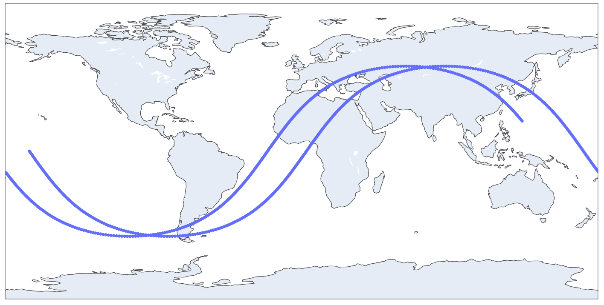
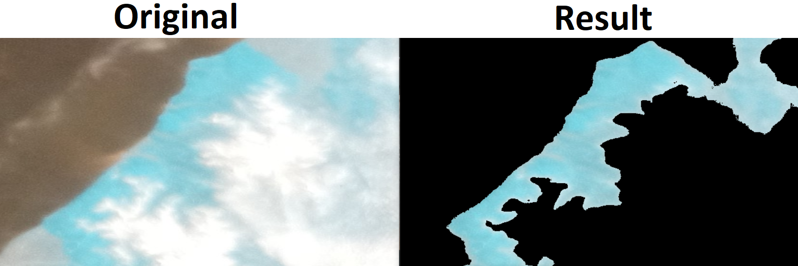
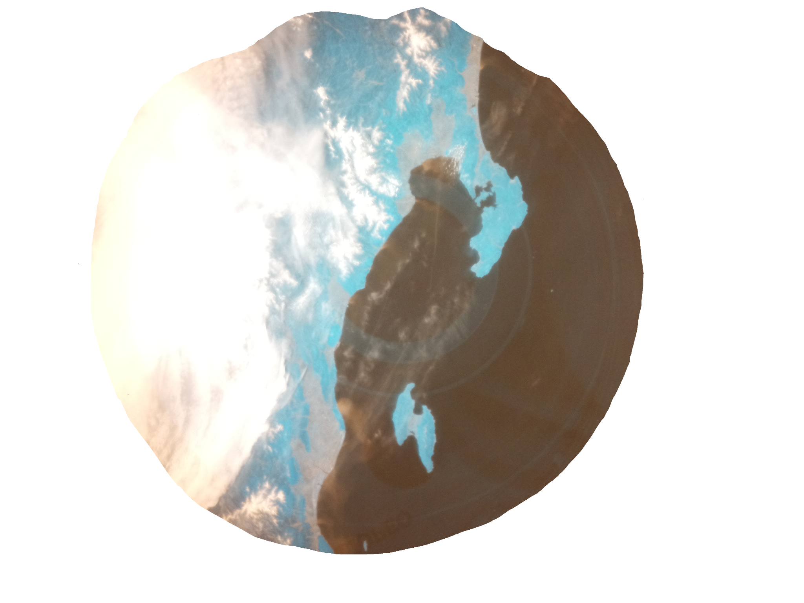
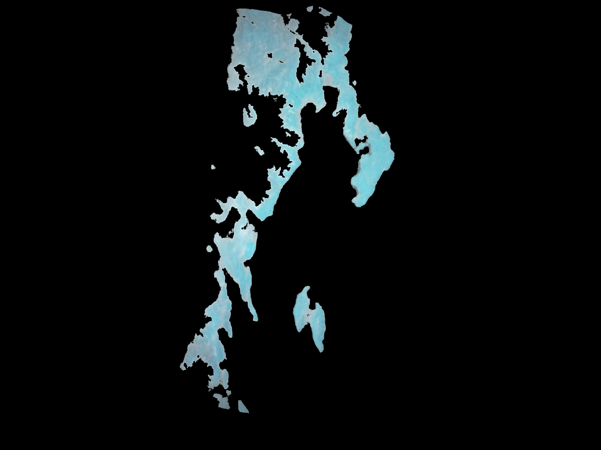
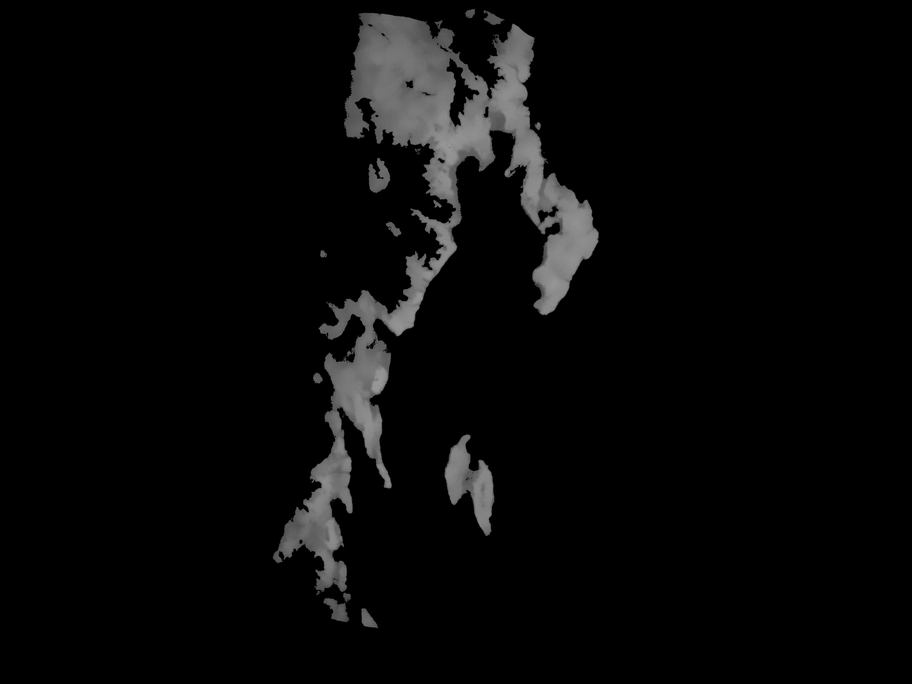
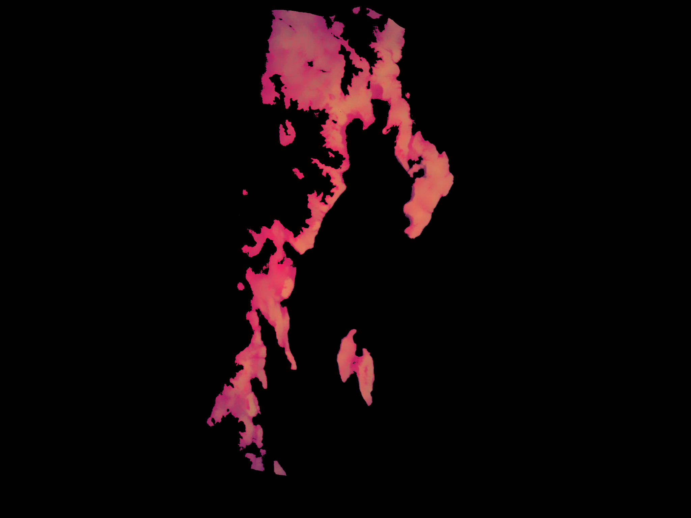
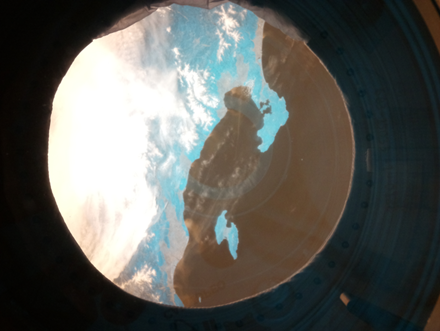
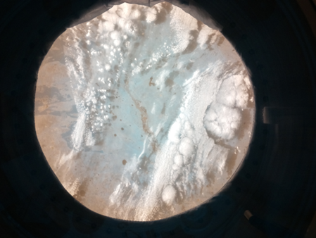

## What is this?

This is a submition for Astro Pi: Mission Space Lab 2022 for team TingTarT with images, code and phase 3 report

***

Team name: TingTartT

Chosen theme: Life on Earth

Organisation name: Kvadraturen Videregående skole

Country: Norway

## 1\. Introduction

**\_\_\_\_\_\_\_\_\_\_\_\_\_\_\_\_\_\_\_\_\_\_\_\_\_\_\_\_\_\_\_\_\_\_\_\_\_\_\_\_\_\_\_\_\_**

> We decided to investigate to what extent volcanic activity like
> volcanic ash and testing of nuclear weapons affect vegetation on
> Earth, by comparing areas that are or have been affected, to areas
> that haven't. We also wanted to use the data we gathered from the ISS
> to compare it with old NDVI data from NASA\'s archive, but we decided
> to use another method because the data we got was not affected by
> circumstances we decided to measure at the same time NASA was
> gathering NDVI data. We think that this experiment is interesting
> because all of us like explosions, and we wanted to investigate how
> they affect vegetation on Earth. We expect to find out that volcanoes
> help vegetation to grow and that nuclear activity doesn't affect
> vegetation amount nearby.

Here is our ISS flight path. Unfortunately, a big part of the earth was
covered by clouds at the time of our investigation, so we got little
data, but we think we used it the best way we could.

 

## 2\. Method

**\_\_\_\_\_\_\_\_\_\_\_\_\_\_\_\_\_\_\_\_\_\_\_\_\_\_\_\_\_\_\_\_\_\_\_\_\_\_\_\_\_\_\_\_\_**

We decided to measure how volcanic activity and nuclear explosions
affect the vegetation amount on earth. We used a camera with an NDVI
filter to take photos and save them in JPEG format along with data to
find the location and time the photos were taken, we kept these types of
data in a CSV file.
 

We wrote a script that calculates average vegetation in the photos we
gathered from the ISS and NDVI data from NASA\'s archives. The script
requires one or two photos, one from ISS and one from an HDF file from
the MOBIUS sensor that we found on
[[search.earthdata.nasa.gov]{.ul}](https://search.earthdata.nasa.gov/).
The script can cut off every unnecessary detail leaving the vegetation
as you can see in the Image 2. As an output, we get the average
brightness of the images. It represents the average amount of
vegetation, we are not calculating the NDVI value because we are only
interested in comparing the data with photos in NASA\'s archive and
areas we got photos of. With average brightness, we can calculate the
average density of vegetation that we use for compressing.

Repository with all scripts -
[[https://github.com/Smulee/AstroPi2022-TingTarT]](https://github.com/Smulee/AstroPi2022-TingTarT)

 

The process of processing images:

 

 

## 3\. Experiment results

**\_\_\_\_\_\_\_\_\_\_\_\_\_\_\_\_\_\_\_\_\_\_\_\_\_\_\_\_\_\_\_\_\_\_\_\_\_\_\_\_\_\_\_\_\_**

We flew over two areas that we found useful:

-   The Semipalatinsk nuclear test site in Kazakhstan which is the
    biggest Soviet nuclear polygon.

-   The west part of Japan. Japan is full of volcanoes, and the part
    that we were lucky to get. Has active volcanoes nearby.

The volcano that we used for analyzing the effect
volcanoes have on vegetation is called Niigata-Yake-Yama. The last time
it erupted was in 1974. NASA doesn\'t have NDVI data that goes so far
back in time. So we could not analyze it the way we initially wanted.
Instead, we compared vegetation near the volcano with vegetation in an
area of Japan with no volcanoes, this region is the coast of Tottori.

We found no evidence for our hypothesis.
The density of vegetation on the coast of Tottori is around 80% and the
vegetation near the volcano Niigata-Yake-Yama is 79.2%, practically the
same. We think it may be unaffected because of how long it's been since
the last eruption, or that the soil in Japan is so good that it supports
a big density of vegetation in all areas, so even if the soil would have
more nutrients it wouldn\'t affect the density of vegetation.

This test site was in use from 1945 to 1991, NASA\'s NDVI data go back
to 2000 so we could not analyze the initial effect of radiation on the
vegetation nearby. So instead, we compared the area around the site with
other parts of Kazakhstan that were not affected by radiation. The exact
place of testing was partly covered by clouds and shadows of clouds
during our pictures. We got data just from a small portion of this area.

Although we found no evidence that radiation from nuclear explosions
affects the amount of vegetation on earth, as expected.

## 4\. Learnings

**\_\_\_\_\_\_\_\_\_\_\_\_\_\_\_\_\_\_\_\_\_\_\_\_\_\_\_\_\_\_\_\_\_\_\_\_\_\_\_\_\_\_\_\_\_**

Our team is made of students who like data science, physics, and
electronics, so it was fun for us to participate. We had many meetings
to maintain good communication in the team, we made a discord server for
sharing data and talking. In addition, the organization of work wasn\'t
demanding for each member, we spoke about what must be done, and if
anyone had time then he did as much as he could. We organized it this
way because we had a lot of time to get the work done. The biggest
challenge was that we didn\'t know how to analyze photos, so we needed
to develop a way of doing that by ourselves, luckily one of us has
previous experience working with CV2, so we found a method to do this
without learning everything from scratch. We learned how to use NASA\'s
archives and take data from these, as well as work with the .HDF format
that is used for storing scientific data. Next time we should be
together in the same room more while working on planning, coding, and
analyzing. During this project we did not do that and that caused some
communication problems.

## 5\. Conclusion

**\_\_\_\_\_\_\_\_\_\_\_\_\_\_\_\_\_\_\_\_\_\_\_\_\_\_\_\_\_\_\_\_\_\_\_\_\_\_\_\_\_\_\_\_\_**

Based on our findings, we cannot prove the first part of our initial
hypothesis that volcanoes would help the growth vegetation. But we can
conclude that Vegetation in Japan is not affected by volcanic eruptions
older than 50 years. Though this may not be the case in other locations,
as we only analyzed a single volcanic site. On the other hand, the data
from the nuclear site concur with our hypothesis that radiation would
not affect vegetation amount in the long term because we found no
evidence that radiation from nuclear explosions influences the amount of
vegetation on earth in any direction. In addition, we learned a lot
about analyzing and working with photos in python and gathering data
from NASA\'s archive as well as using them. This way of working on a
project is different from what school has made us used to, so it was a
good experience to learn other ways of working on projects.

We would love to thank ESA and the Raspberry Pi foundation for making
AstroPi happen and that we could participate, it was a lot of fun, and
some of us will definitely participate again.
